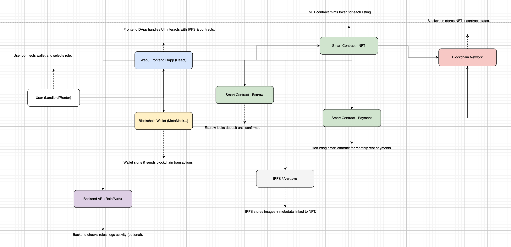

# Blockchain Rental Application

## Tài liệu chi tiết về Luồng hoạt động của Sản phẩm Web3 cho thuê nhà

### 1. Tổng quan về sản phẩm

Sản phẩm cung cấp nền tảng cho thuê nhà dựa trên công nghệ Blockchain. Tài sản cho thuê được đại diện dưới dạng NFT để đảm bảo tính minh bạch, chống giả mạo và đảm bảo độ tin cậy cho người dùng.
Người dùng sử dụng hợp đồng thông minh (Smart Contract) để thực hiện giao dịch P2P với người cho thuê trong trường hợp đặt cọc và thanh toán phí thuê nhà theo tháng.

### 2. Các đối tượng tham gia

- Người cho thuê (Owner)

- Người thuê (Renter)

- Hợp đồng thông minh (Smart Contract)

- NFT đại diện tài sản (NFT Property)

- Ví Blockchain (Blockchain Wallet)

### 3. Luồng hoạt động chi tiết

#### A. Người cho thuê đăng nhà

Luồng:

- Người cho thuê kết nối ví blockchain (MetaMask, WalletConnect...)

- Đăng nhập / xác thực quyền hạn (kết nối tới back-end)

- Điền form thông tin nhà (địa chỉ, hình ảnh, giá thuê, điều khoản, thời gian thuê…)

- Hệ thống tạo metadata + hình ảnh lưu IPFS, tạo NFT đại diện cho nhà

- Triển khai NFT token bằng Smart Contract => người cho thuê là owner

- NFT sẽ chứa: tokenId, metadataURL, wallet_owner, status = available

- Output: NFT đại diện 1 nhà cho thuê, có thể kiểm tra thông tin công khai.

#### B. Người thuê xác minh và yêu cầu thuê

Luồng:

- Người thuê kết nối ví blockchain

- Truy cập danh sách nhà => Xem thông tin từ NFT => Xác minh tính minh bạch tài sản của chủ sở hữu

- Click "Yêu cầu thuê" => triển khai Escrow Smart Contract

- Escrow này lock số tiền đặt cọc (ví dụ 1 tháng) trong khoảng thời gian X (ví dụ 3 ngày)

- Người thuê liên hệ chủ nhà và đi xem trực tiếp.

#### C. Giao dịch & đặt cọc

Luồng:

- Nếu 2 bên đồng ý => Người thuê xác nhận "Tiến hành thuê"

- Escrow contract unlock => Chuyển tiền đặt cọc tới chủ nhà.

- Giao dịch được ghi lại on-chain.

- NFT có thể cập nhật trạng thái rented hoặc gắn thêm metadata về người thuê.

#### D. Thanh toán tiền thuê hàng tháng (tự động hóa)

Cách triển khai:

- Triển khai Smart Contract cho thuê định kỳ: hỗ trợ subscription hoặc payment trigger mỗi tháng.

- Người thuê phải approve trước 1 allowance token (USDT) để hệ thống tự động deduct mỗi kỳ.

- Nếu không đủ balance => raise sự kiện PaymentFailed.

- Người thuê và người cho thuê sẽ mở trạng thái Smart Contract paying monthly.

#### E. Kết thúc hợp đồng

- Khi thời gian thuê kết thúc hoặc có sự đồng thuận chấm dứt từ hai bên, hợp đồng thông minh được hoàn tất.

- NFT của tài sản quay trở lại trạng thái sẵn sàng cho thuê hoặc Owner có thể gỡ bỏ khỏi hệ thống.

#### F. Phân quyền và đăng nhập

Cơ chế:

- Xác thực thông qua ví + chữ ký điện tử (message signing)

- Phân quyền dựa trên role lưu ở smart contract hoặc backend off-chain:

  - ROLE_OWNER: đăng tin, tạo NFT

  - ROLE_RENTER: xem + thuê

  - ROLE_ADMIN: quản lý hệ thống

### 4. Công nghệ sử dụng

- Front-end: Next.js + Web3.js/Ethers.js
- Back-end: Node.js / Java + Spring Boot
- Blockchain Network: Ripple Network / Polygon / BNB Chain / ..etc..
- Wallet: Metamask / WalletConnect /..etc..
- NFT: ERC-721 hoặc ERC-1155
- Smart Contract: Solidity, Chainlink Automation
- Period Payment: Chainlink Keeper, Superfluid
- Storage: IPFS, Pinata, Web3.Storage

### 5. Sơ đồ tổng quát

